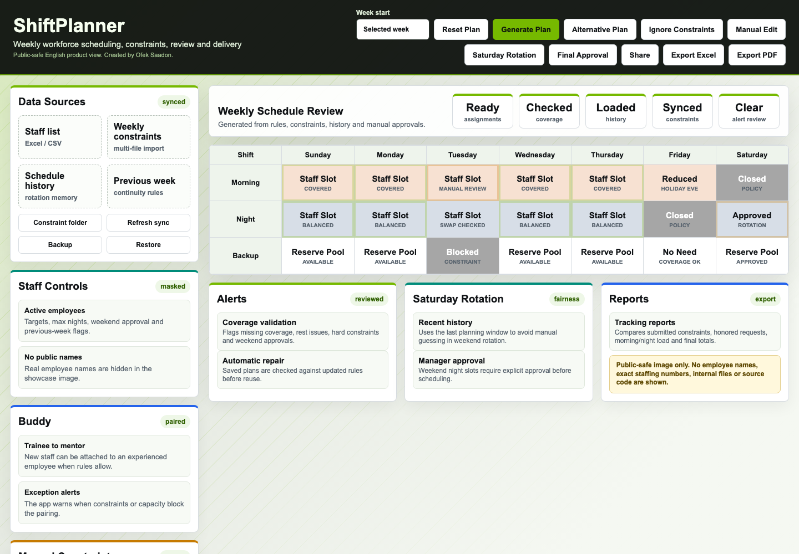

# ShiftPlanner

Public showcase for a private workforce scheduling application.

The real source code, staff data and operational files are private. This repository contains only sanitized screenshots and a professional project explanation.

## Product View

## Workflow, Functions And Impact

## What This Project Does

ShiftPlanner turns a weekly, Excel-heavy scheduling process into a guided workflow: import requests, generate a first plan, review conflicts, approve exceptions and export the final schedule.

The public screenshots are intentionally anonymized. They do not show employee names, exact staffing numbers, internal Excel files, SharePoint paths or business-sensitive scheduling data.

## Main Functions

- Imports employee lists from Excel or CSV.
- Imports weekly constraints from multiple files and stores them by week.
- Reads synced SharePoint/OneDrive folders and refreshes the matching weekly constraint file.
- Detects the relevant week from file names or file content.
- Generates an automatic schedule using coverage, rest, night-load, weekend rotation and availability rules.
- Supports alternative schedule generation for the same week.
- Allows manual editing after automatic generation.
- Supports buddy pairing between new and experienced staff, including conflict alerts.
- Handles manual constraints: unavailable, prefer and must.
- Handles Jewish and company holidays with manual override.
- Uses recent history to support fair weekend rotation.
- Shows alerts for missing coverage, rest issues, hard constraints and approval problems.
- Provides tracking reports for submitted constraints, honored requests and shift load.
- Exports the final schedule to PDF and Excel.
- Supports sharing the final schedule through normal team channels.
- Supports backup and restore of the full local planning state.
- Can be distributed as a closed desktop app without exposing source files.

## Work Impact

Estimated impact: **2-4 hours saved per weekly schedule cycle**.

This is a conservative portfolio estimate, not a measured production KPI. The time saving comes from reducing manual Excel merging, checking constraints by hand, validating weekend rotation, balancing night coverage, reviewing exceptions and preparing the final PDF/Excel output.

## My Work

I built the scheduling interface, optimization/rule engine, import/export workflow, constraint handling, holiday logic, history-based rotation support, buddy flow, manual editing flow, alerts, reports, backup/restore, closed app packaging and user documentation.

## Privacy And Access

This repository intentionally contains only:

- `README.md`
- sanitized showcase images

It does not include source code, employee names, staff counts, internal Excel files, SharePoint paths, credentials or business-sensitive scheduling data.

Source code: private.
